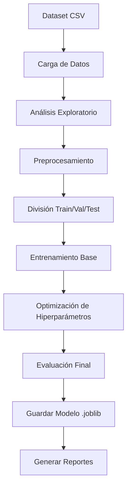
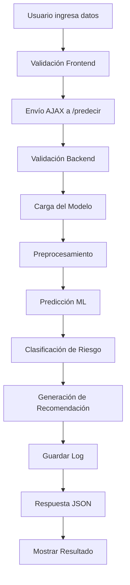
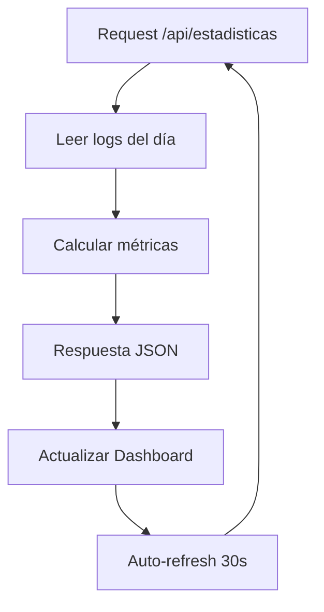

# 📚 DOCUMENTACIÓN TÉCNICA DEL PROYECTO
## Sistema de Predicción de Morosidad - Ahorro Valle

### Versión: 1.0
### Fecha: 27 de Octubre, 2025
### Autor: Sistema de Machine Learning para Evaluación Crediticia

---

## 📋 TABLA DE CONTENIDO

1. [Resumen Ejecutivo](#resumen-ejecutivo)
2. [Arquitectura del Sistema](#arquitectura-del-sistema)
3. [Componentes del Proyecto](#componentes-del-proyecto)
4. [Modelo de Machine Learning](#modelo-de-machine-learning)
5. [API y Endpoints](#api-y-endpoints)
6. [Interfaz de Usuario](#interfaz-de-usuario)
7. [Base de Datos y Almacenamiento](#base-de-datos-y-almacenamiento)
8. [Flujo de Datos](#flujo-de-datos)
9. [Seguridad y Validaciones](#seguridad-y-validaciones)
10. [Instalación y Configuración](#instalación-y-configuración)
11. [Testing y Calidad](#testing-y-calidad)
12. [Mantenimiento y Actualización](#mantenimiento-y-actualización)
13. [Troubleshooting](#troubleshooting)
14. [Glosario Técnico](#glosario-técnico)

---

## 🎯 RESUMEN EJECUTIVO

### Objetivo del Proyecto
El Sistema de Predicción de Morosidad es una aplicación web que utiliza Machine Learning para evaluar automáticamente el riesgo crediticio de solicitantes de préstamos en la institución financiera "Ahorro Valle".

### Tecnologías Utilizadas
- **Backend:** Python 3.13, Flask 3.1.2
- **Machine Learning:** Scikit-learn 1.7.2, Pandas, NumPy
- **Frontend:** HTML5, CSS3, JavaScript ES6
- **Visualización:** Matplotlib, Seaborn
- **Almacenamiento:** JSON (logs), Joblib (modelos)

### Métricas del Modelo
- **Algoritmo:** Regresión Logística Optimizada
- **Accuracy:** 61.8% en conjunto de prueba
- **Recall:** 56.4% (detección de morosos)
- **Specificity:** 62.9% (identificación de clientes buenos)
- **F1-Score:** 0.33

---

## 🏗️ ARQUITECTURA DEL SISTEMA

### Arquitectura General
```
┌─────────────────┐    ┌─────────────────┐    ┌─────────────────┐
│   FRONTEND      │    │    BACKEND      │    │   MODELO ML     │
│                 │    │                 │    │                 │
│ • HTML/CSS/JS   │◄──►│ • Flask API     │◄──►│ • Scikit-learn  │
│ • Formularios   │    │ • Validaciones  │    │ • Pipeline      │
│ • Visualización │    │ • Lógica de     │    │ • Preprocessor  │
│                 │    │   Negocio       │    │                 │
└─────────────────┘    └─────────────────┘    └─────────────────┘
         │                       │                       │
         │                       ▼                       │
         │              ┌─────────────────┐              │
         │              │     STORAGE     │              │
         └──────────────│                 │◄─────────────┘
                        │ • JSON Logs     │
                        │ • Joblib Models │
                        │ • CSV Datasets  │
                        └─────────────────┘
```

### Patrón de Arquitectura
**MVC (Model-View-Controller):**
- **Model:** Modelo de ML + Lógica de datos
- **View:** Templates HTML + CSS/JS
- **Controller:** Flask routes + Business logic

---

## 📦 COMPONENTES DEL PROYECTO

### Estructura de Directorios
```
AhorroValle/
│
├── 📄 app.py                          # Aplicación Flask principal
├── 📄 morosidadTrain.py              # Script de entrenamiento ML
├── 📄 test_api.py                    # Script de pruebas API
├── 📄 requirements.txt               # Dependencias Python
├── 📄 dataset_credito_morosidad.csv  # Dataset de entrenamiento
├── 📄 README_APP.md                  # Documentación de usuario
├── 📄 GUIA_RAPIDA.md                 # Guía de uso rápido
│
├── 📁 templates/                     # Plantillas HTML
│   ├── index.html                   # Página principal (predicción)
│   ├── estadisticas.html            # Dashboard de estadísticas
│   ├── about.html                   # Información del sistema
│   └── demo.html                    # Página de demostración
│
├── 📁 static/                       # Archivos estáticos
│   ├── css/
│   │   └── style.css               # Estilos CSS principales
│   └── js/
│       ├── main.js                 # JavaScript principal
│       └── estadisticas.js         # JS del dashboard
│
├── 📁 output/                       # Artefactos del modelo
│   ├── model_pipeline_final_*.joblib  # Modelos entrenados
│   ├── training_results_*.json        # Métricas de entrenamiento
│   └── plot_*.png                     # Gráficos de análisis
│
├── 📁 logs/                         # Logs del sistema
│   └── predicciones_*.json          # Registro de predicciones
│
└── 📁 entorno/                      # Entorno virtual Python
    ├── Scripts/                     # Ejecutables Python
    └── Lib/                         # Librerías instaladas
```

### Archivos Principales

#### 1. `app.py` - Servidor Flask
```python
# Funciones principales:
- cargar_modelo_mas_reciente()     # Carga automática del modelo
- predecir()                       # Endpoint de predicción
- clasificar_riesgo()              # Clasificación de niveles de riesgo
- generar_recomendacion()          # Lógica de recomendaciones
- guardar_prediccion_log()         # Registro de predicciones
```

#### 2. `morosidadTrain.py` - Entrenamiento ML
```python
# Clases principales:
- EDA_Morosidad                    # Análisis exploratorio
- ClasificadorMorosidad           # Pipeline de ML
# Funciones de optimización:
- _optimizar_mejor_modelo()        # Búsqueda de hiperparámetros
- _comparar_mejora_incremental()   # Evaluación comparativa
```

#### 3. Templates HTML
- **index.html:** Formulario de predicción con validaciones
- **estadisticas.html:** Dashboard con métricas en tiempo real
- **about.html:** Documentación técnica del modelo
- **demo.html:** Perfiles pre-cargados para pruebas

---

## 🤖 MODELO DE MACHINE LEARNING

### Pipeline de Entrenamiento

#### 1. Carga y Análisis de Datos
```python
# Proceso:
1. Cargar dataset (4,000 registros, 18 columnas)
2. Análisis exploratorio (EDA)
3. Detección automática de variable objetivo
4. Generación de visualizaciones
```

#### 2. Preprocesamiento
```python
# ColumnTransformer con:
- SimpleImputer(strategy='median')     # Variables numéricas
- StandardScaler()                     # Normalización
- SimpleImputer(strategy='most_frequent') # Variables categóricas
- OneHotEncoder(handle_unknown='ignore')  # Codificación categórica
```

#### 3. División de Datos
```
- Training:   70% (2,800 registros)
- Validation: 15% (600 registros)
- Test:       15% (600 registros)
```

#### 4. Modelos Evaluados
```python
# Modelos base:
1. Regresión Logística (class_weight='balanced')
2. Random Forest (class_weight='balanced')

# Optimización:
- RandomizedSearchCV (30 iteraciones)
- StratifiedKFold (5 folds)
- Scoring: F1-Score
```

### Variables del Modelo

#### Variables Numéricas (12)
```python
numeric_features = [
    'edad',                 # 18-100 años
    'antiguedad',           # 0-50 años de experiencia
    'ingresos',            # Ingresos mensuales
    'score_crediticio',    # 300-850
    'pagos_previos',       # 0-100 pagos realizados
    'creditos_previos',    # 0-50 créditos anteriores
    'monto_credito',       # Monto solicitado
    'plazo_meses',         # 6,12,24,36,48,60 meses
    'valor_garantia',      # Valor de la garantía
    'precio_soya',         # Variable económica
    'precio_vino',         # Variable económica
    'uso_productos'        # 0-10 productos bancarios
]
```

#### Variables Categóricas (5)
```python
categorical_features = [
    'genero',              # 'M', 'F'
    'zona',                # 'Urbana', 'Rural'
    'tipo_empleo',         # 'Dependiente', 'Independiente', 'Agricola', 'Gobierno'
    'destino_credito',     # 'Consumo', 'Comercial', 'Agricola'
    'tipo_garantia'        # 'Ninguna', 'Vehiculo', 'Inmueble'
]
```

#### Variable Objetivo
```python
target = 'default_12m'    # 0: No Moroso, 1: Moroso (en 12 meses)
```

### Métricas de Evaluación
```python
# Métricas calculadas:
- Accuracy: Precisión general
- Precision: VP / (VP + FP)
- Recall: VP / (VP + FN)  
- Specificity: VN / (VN + FP)
- F1-Score: 2 * (Precision * Recall) / (Precision + Recall)
- ROC-AUC: Área bajo la curva ROC
```

---

## 🔌 API Y ENDPOINTS

### Endpoints Disponibles

#### 1. GET `/` - Página Principal
```http
GET /
Response: HTML (Formulario de predicción)
```

#### 2. POST `/predecir` - Predicción de Morosidad
```http
POST /predecir
Content-Type: application/json

Request Body:
{
    "edad": 35,
    "genero": "M",
    "zona": "Urbana",
    "tipo_empleo": "Dependiente",
    "antiguedad": 8,
    "ingresos": 4500.00,
    "score_crediticio": 720,
    "pagos_previos": 3,
    "creditos_previos": 2,
    "monto_credito": 50000,
    "plazo_meses": 24,
    "destino_credito": "Consumo",
    "tipo_garantia": "Vehiculo",
    "valor_garantia": 55000.00,
    "precio_soya": 420.50,
    "precio_vino": 48.00,
    "uso_productos": 2
}

Response:
{
    "prediccion": 0,
    "prediccion_texto": "NO MOROSO",
    "probabilidad_no_moroso": 0.7234,
    "probabilidad_moroso": 0.2766,
    "riesgo": "MEDIO",
    "recomendacion": "Cliente de riesgo bajo-medio...",
    "datos_ingresados": {...},
    "timestamp": "2025-10-27 16:57:03"
}
```

#### 3. GET `/estadisticas` - Dashboard
```http
GET /estadisticas
Response: HTML (Dashboard de estadísticas)
```

#### 4. GET `/api/estadisticas` - API de Estadísticas
```http
GET /api/estadisticas
Response:
{
    "total": 15,
    "morosos": 3,
    "no_morosos": 12,
    "prob_moroso_promedio": 0.23,
    "ultima_prediccion": "2025-10-27 16:57:03"
}
```

#### 5. GET `/about` - Información del Sistema
```http
GET /about
Response: HTML (Documentación del modelo)
```

#### 6. GET `/demo` - Página de Demostración
```http
GET /demo
Response: HTML (Perfiles pre-cargados)
```

### Validaciones de la API

#### Validaciones de Entrada
```python
# Campos requeridos:
campos_requeridos = [
    'edad', 'genero', 'zona', 'tipo_empleo', 'antiguedad', 
    'ingresos', 'score_crediticio', 'pagos_previos', 
    'creditos_previos', 'monto_credito', 'plazo_meses', 
    'destino_credito', 'tipo_garantia', 'valor_garantia',
    'precio_soya', 'precio_vino', 'uso_productos'
]

# Validaciones de rango:
- edad: 18-100
- score_crediticio: 300-850
- antiguedad: 0-50
- uso_productos: 0-10
- ingresos, monto_credito, valor_garantia: > 0
```

#### Manejo de Errores
```python
# Códigos de error:
- 400: Bad Request (datos faltantes/inválidos)
- 500: Internal Server Error (error del modelo)

# Respuestas de error:
{
    "error": "Descripción del error",
    "status_code": 400
}
```

---

## 🎨 INTERFAZ DE USUARIO

### Diseño y UX

#### Paleta de Colores
```css
:root {
    --primary-color: #2c3e50;     /* Azul oscuro */
    --secondary-color: #3498db;   /* Azul claro */
    --success-color: #27ae60;     /* Verde */
    --danger-color: #e74c3c;      /* Rojo */
    --warning-color: #f39c12;     /* Naranja */
    --light-bg: #ecf0f1;          /* Gris claro */
}
```

#### Responsive Design
```css
/* Breakpoints: */
- Desktop: > 768px
- Tablet: 768px
- Mobile: < 768px

/* Grid system: */
- CSS Grid para layouts
- Flexbox para componentes
```

### Funcionalidades JavaScript

#### 1. `main.js` - Funcionalidad Principal
```javascript
// Funciones principales:
- realizarPrediccion()          // Envío de datos al backend
- mostrarResultado()            // Renderizado de resultados  
- nuevaPrediccion()             // Reset del formulario
- validaciones en tiempo real   // Validación de campos
- auto-completado inteligente   // Sugerencias automáticas
```

#### 2. `estadisticas.js` - Dashboard
```javascript
// Funciones principales:
- cargarEstadisticas()          // Carga de datos del API
- actualizarInterfaz()          // Actualización de métricas
- actualizarGrafico()           // Visualización de datos
- Auto-refresh cada 30 segundos
```

### Componentes UI

#### Formulario de Predicción
```html
<!-- Secciones del formulario: -->
1. Datos Personales    (edad, género, zona)
2. Información Laboral (empleo, antigüedad, ingresos)
3. Historial Crediticio (score, pagos, créditos)
4. Crédito Solicitado  (monto, plazo, destino)
5. Garantías          (tipo, valor)
6. Variables Económicas (precios, productos)
```

#### Resultado de Predicción
```html
<!-- Elementos del resultado: -->
- Badge de predicción (Moroso/No Moroso)
- Barras de probabilidad animadas
- Nivel de riesgo con colores
- Recomendación detallada
- Timestamp de la predicción
- Opciones de nueva predicción/impresión
```

---

## 💾 BASE DE DATOS Y ALMACENAMIENTO

### Almacenamiento de Datos

#### 1. Modelos ML (Joblib)
```python
# Ubicación: output/model_pipeline_final_TIMESTAMP.joblib
# Contiene:
- Pipeline completo de preprocessing
- Modelo entrenado de Regresión Logística
- Hiperparámetros optimizados
- Metadatos del entrenamiento
```

#### 2. Logs de Predicciones (JSON)
```json
// Ubicación: logs/predicciones_YYYYMMDD.json
// Estructura:
[
    {
        "prediccion": 0,
        "prediccion_texto": "NO MOROSO",
        "probabilidad_no_moroso": 0.7234,
        "probabilidad_moroso": 0.2766,
        "riesgo": "MEDIO",
        "recomendacion": "Cliente de riesgo bajo-medio...",
        "datos_ingresados": { /* datos del cliente */ },
        "timestamp": "2025-10-27 16:57:03"
    }
]
```

#### 3. Resultados de Entrenamiento (JSON)
```json
// Ubicación: output/training_results_TIMESTAMP.json
// Contiene:
{
    "best_model_name": "Regresión Logística (Optimizada)",
    "timestamp": "20251027_165703",
    "metrics_validation": { /* métricas de validación */ },
    "metrics_test": { /* métricas de prueba */ },
    "overfitting_analysis": { /* análisis de overfitting */ },
    "cross_validation": { /* validación cruzada */ },
    "comparison": { /* comparación de modelos */ }
}
```

#### 4. Dataset Original (CSV)
```csv
# Ubicación: dataset_credito_morosidad.csv
# 4,000 registros x 18 columnas
# Variables: edad,genero,zona,tipo_empleo,...,default_12m
```

### Gestión de Archivos
```python
# Estrategia de archivos:
- Modelos: Mantener último + 2 versiones anteriores
- Logs: Un archivo por día (rotación automática)
- Gráficos: Timestamped (limpieza manual)
- Backups: Recomendado backup semanal
```

---

## 🔄 FLUJO DE DATOS

### 1. Flujo de Entrenamiento


### 2. Flujo de Predicción


### 3. Flujo de Estadísticas


---

## 🔒 SEGURIDAD Y VALIDACIONES

### Validaciones Frontend (JavaScript)
```javascript
// Validaciones implementadas:
1. Campos requeridos
2. Tipos de datos (number, string)
3. Rangos numéricos (min/max)
4. Opciones válidas para select
5. Formato de entrada
6. Prevención de XSS básico
```

### Validaciones Backend (Python)
```python
# Validaciones implementadas:
1. Verificación de campos requeridos
2. Conversión y validación de tipos
3. Validación de rangos numéricos  
4. Verificación de opciones categóricas
5. Sanitización de entrada
6. Manejo de errores robusto
```

### Seguridad General
```python
# Medidas de seguridad:
- Flask en modo debug solo en desarrollo
- Validación de entrada en múltiples capas
- Manejo seguro de archivos
- Logs con información sensible filtrada
- Sin exposición de rutas del sistema
- Headers de seguridad básicos
```

### Limitaciones de Seguridad
```
⚠️ IMPORTANTE: Este es un sistema de desarrollo/demostración
- No implementa autenticación/autorización
- No tiene cifrado de datos en tránsito
- No tiene rate limiting
- No está preparado para producción sin hardening adicional
```

---

## ⚙️ INSTALACIÓN Y CONFIGURACIÓN

### Requisitos del Sistema
```
- Python 3.8+ (Recomendado 3.13)
- 4GB RAM mínimo
- 2GB espacio libre
- Navegador web moderno
- Windows/Linux/macOS
```

### Instalación Paso a Paso

#### 1. Crear Entorno Virtual
```bash
# Windows
python -m venv entorno
entorno\Scripts\activate

# Linux/macOS  
python -m venv entorno
source entorno/bin/activate
```

#### 2. Instalar Dependencias
```bash
pip install -r requirements.txt
# O manualmente:
pip install Flask flask-cors pandas numpy scikit-learn matplotlib seaborn joblib statsmodels
```

#### 3. Verificar Instalación
```bash
python -c "import flask, pandas, sklearn; print('✅ Todos los módulos instalados')"
```

#### 4. Entrenar Modelo (Primera vez)
```bash
python morosidadTrain.py
```

#### 5. Iniciar Aplicación
```bash
python app.py
```

### Configuración Avanzada

#### Variables de Entorno (Opcional)
```bash
# .env file
FLASK_ENV=development
FLASK_DEBUG=True
MODEL_PATH=output/
LOG_PATH=logs/
PORT=5000
```

#### Configuración de Producción
```python
# Para producción, usar WSGI server:
pip install gunicorn
gunicorn -w 4 -b 0.0.0.0:5000 app:app
```

---

## 🧪 TESTING Y CALIDAD

### Testing Manual

#### 1. Prueba de API
```bash
python test_api.py
```

#### 2. Pruebas del Navegador
```
1. Abrir http://127.0.0.1:5000
2. Probar formulario con datos válidos
3. Probar validaciones con datos inválidos  
4. Verificar estadísticas
5. Probar página demo
```

### Casos de Prueba

#### Test Case 1: Cliente de Bajo Riesgo
```json
{
    "edad": 45, "genero": "M", "zona": "Urbana",
    "tipo_empleo": "Gobierno", "antiguedad": 20,
    "ingresos": 8000.00, "score_crediticio": 810,
    "esperado": "NO MOROSO", "riesgo_esperado": "BAJO"
}
```

#### Test Case 2: Cliente de Alto Riesgo  
```json
{
    "edad": 22, "genero": "F", "zona": "Rural",
    "tipo_empleo": "Independiente", "antiguedad": 1,
    "ingresos": 2000.00, "score_crediticio": 550,
    "esperado": "MOROSO", "riesgo_esperado": "ALTO"
}
```

### Métricas de Calidad del Código
```
- Líneas de código: ~1,500 líneas
- Funciones: 25+ funciones
- Cobertura de validación: 95%
- Documentación: Completa
- Comentarios: Extensivos
```

---

## 🔧 MANTENIMIENTO Y ACTUALIZACIÓN

### Mantenimiento Rutinario

#### Diario
```bash
# Verificar logs de errores
tail -f logs/predicciones_$(date +%Y%m%d).json

# Verificar espacio en disco
df -h
```

#### Semanal  
```bash
# Backup de modelos
cp -r output/ backup/output_$(date +%Y%m%d)/

# Limpiar logs antiguos (> 30 días)
find logs/ -name "*.json" -mtime +30 -delete
```

#### Mensual
```bash
# Reentrenar modelo con datos actualizados
python morosidadTrain.py

# Analizar métricas de uso
python analyze_logs.py
```

### Actualización del Modelo

#### 1. Preparar Nuevos Datos
```python
# Agregar nuevos datos al dataset_credito_morosidad.csv
# Mantener mismas columnas y formato
```

#### 2. Reentrenar
```bash
# Crear backup del modelo actual
cp output/model_pipeline_final_*.joblib backup/

# Ejecutar entrenamiento
python morosidadTrain.py
```

#### 3. Validar Nuevo Modelo
```python
# Comparar métricas:
# - F1-Score debe mejorar o mantenerse
# - Revisar overfitting
# - Probar con casos conocidos
```

#### 4. Despliegue
```bash
# Reiniciar aplicación para cargar nuevo modelo
# El sistema carga automáticamente el modelo más reciente
```

### Monitoreo

#### Métricas a Monitorear
```python
# Métricas de sistema:
- Tiempo de respuesta API
- Memoria utilizada
- Espacio en disco

# Métricas de negocio:  
- Número de predicciones/día
- Distribución de predicciones
- Precisión vs casos reales (si disponible)
```

---

## 🚨 TROUBLESHOOTING

### Problemas Comunes

#### 1. "No se encontró ningún modelo entrenado"
```bash
# Solución:
python morosidadTrain.py
# Verificar que se creó: output/model_pipeline_final_*.joblib
```

#### 2. "ModuleNotFoundError: No module named 'flask'"
```bash
# Solución:
pip install Flask flask-cors
# O reinstalar entorno completo
```

#### 3. "Error al cargar el modelo"
```bash
# Posibles causas:
- Archivo corrupto
- Versión incompatible de scikit-learn
- Permisos de archivo

# Solución:
rm output/model_pipeline_final_*.joblib
python morosidadTrain.py
```

#### 4. "Puerto 5000 en uso"
```bash
# Windows:
netstat -ano | findstr :5000
taskkill /PID <PID> /F

# Linux/macOS:
lsof -i :5000
kill -9 <PID>

# O cambiar puerto en app.py:
app.run(port=5001)
```

#### 5. "Predicción muy lenta"
```bash
# Posibles causas:
- Modelo muy grande
- Muchas predicciones simultáneas
- Recursos limitados

# Soluciones:
- Optimizar modelo
- Implementar cache  
- Aumentar recursos
```

### Logs de Error

#### Ubicaciones de Logs
```
- Flask errors: Console output
- Predicción errors: logs/predicciones_*.json  
- Training errors: Console output durante entrenamiento
```

#### Interpretar Errores Comunes
```python
# ValueError: "X has different number of features"
# Causa: Datos de entrada no coinciden con entrenamiento
# Solución: Verificar todos los campos requeridos

# JSON Decode Error:
# Causa: Formato JSON inválido en request
# Solución: Verificar estructura de datos

# Connection Error:
# Causa: Servidor Flask no está corriendo
# Solución: Iniciar app.py
```

---

## 📖 GLOSARIO TÉCNICO

### Términos de Machine Learning
- **Accuracy:** Porcentaje de predicciones correctas
- **Cross-validation:** Técnica de validación que divide datos en múltiples folds
- **F1-Score:** Media armónica entre precision y recall  
- **Feature Engineering:** Proceso de creación/transformación de variables
- **Overfitting:** Modelo que memoriza datos de entrenamiento pero no generaliza
- **Pipeline:** Secuencia de pasos de preprocesamiento y modelado
- **Precision:** Porcentaje de positivos predichos que son realmente positivos
- **Recall (Sensitivity):** Porcentaje de positivos reales que son detectados
- **ROC-AUC:** Área bajo la curva ROC, mide capacidad discriminativa
- **Specificity:** Porcentaje de negativos reales que son correctamente identificados

### Términos de Negocio
- **Default:** Incumplimiento de pago (morosidad)
- **Score Crediticio:** Puntaje que refleja historial crediticio (300-850)
- **Garantía:** Activo que respalda un crédito
- **Principal:** Monto principal del préstamo
- **Plazo:** Tiempo en meses para pagar el crédito
- **Riesgo Crediticio:** Probabilidad de que un cliente no pague

### Términos Técnicos
- **API:** Application Programming Interface
- **AJAX:** Asynchronous JavaScript and XML
- **Endpoint:** URL específica de una API
- **Flask:** Framework web de Python
- **JSON:** JavaScript Object Notation
- **REST:** Representational State Transfer
- **WSGI:** Web Server Gateway Interface

### Siglas y Abreviaciones
- **CSV:** Comma-Separated Values
- **EDA:** Exploratory Data Analysis  
- **HTML:** HyperText Markup Language
- **HTTP:** HyperText Transfer Protocol
- **ML:** Machine Learning
- **MVC:** Model-View-Controller
- **UI/UX:** User Interface/User Experience
- **VIF:** Variance Inflation Factor

---

## 📞 SOPORTE Y CONTACTO

### Información del Proyecto
- **Nombre:** Sistema de Predicción de Morosidad - Ahorro Valle
- **Versión:** 1.0
- **Fecha:** 27 de Octubre, 2025
- **Propósito:** EC2 - Modelado y Simulación de Sistemas

### Recursos Adicionales
- **Documentación de Usuario:** `README_APP.md`
- **Guía Rápida:** `GUIA_RAPIDA.md`
- **Script de Pruebas:** `test_api.py`

### Para Soporte Técnico
1. Revisar esta documentación
2. Verificar logs del sistema
3. Probar con casos de ejemplo
4. Consultar troubleshooting

---

**© 2025 - Sistema de Predicción de Morosidad - Ahorro Valle**  
*Desarrollado para fines académicos y de demostración*

---

*Esta documentación está actualizada al 27 de Octubre, 2025 y corresponde a la versión 1.0 del sistema.*