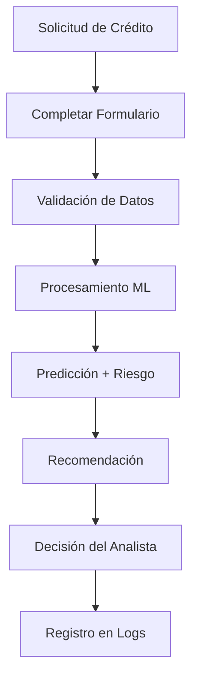

# Sistema de Predicción de Morosidad - Ahorro Valle

**Sistema web inteligente para predicción de riesgo crediticio utilizando Machine Learning**


---

## Descripción del Proyecto

Sistema web interactivo desarrollado para cooperativas financieras que permite evaluar automáticamente el riesgo de morosidad de solicitantes de crédito mediante un modelo de **Regresión Logística optimizada** con una precisión del **61.8%**.

### Características Principales

- **Predicción en Tiempo Real**: Evaluación instantánea de solicitudes
- **Interfaz Web Moderna**: Dashboard intuitivo y responsivo
- **Clasificación de Riesgo**: Categorización automática en 4 niveles
- **Recomendaciones Inteligentes**: Sugerencias para decisiones crediticias
- **Análisis Completo**: Procesamiento de 17 variables de entrada
- **Logging Detallado**: Registro completo de predicciones
- **Validación Robusta**: Sistema de validación multicapa

---

## Modelo de Machine Learning

### Arquitectura del Modelo
- **Algoritmo**: Regresión Logística con optimización de hiperparámetros
- **Accuracy**: 61.8% en conjunto de prueba
- **Pipeline**: Preprocesamiento + Imputación + Escalado + Encoding + Predicción
- **Validación**: Cross-validation de 5 folds con optimización bayesiana

### Variables de Entrada (17 features)

#### Datos Personales
- Edad del solicitante
- Género
- Zona de residencia (Urbana/Rural)

#### Información Laboral
- Tipo de empleo (Empleado/Independiente)
- Antigüedad laboral (años)
- Ingresos mensuales (COP)

#### Detalles del Crédito
- Monto solicitado (COP)
- Plazo en meses
- Destino del crédito

#### Garantías
- Tipo de garantía
- Valor de la garantía (COP)

#### Historial Crediticio
- Credit Score (300-850)
- Número de pagos anteriores
- Número de créditos anteriores

#### Variables Económicas
- Precio de la soya
- Precio del vino
- Uso de productos financieros

## Tecnologías Utilizadas

### Backend
- **Python 3.13.2**
- **Flask 3.1.0** - Framework web
- **Scikit-learn 1.7.2** - Machine Learning
- **Pandas 2.3.3** - Manipulación de datos
- **NumPy 2.3.4** - Computación científica

### Frontend
- **HTML5** - Estructura
- **CSS3** - Estilos responsivos
- **JavaScript ES6** - Interactividad

### Herramientas de Desarrollo
- **Git** - Control de versiones
- **Visual Studio Code** - Editor

---

## Instalación y Configuración

### Prerrequisitos
- Python 3.8 o superior
- Git
- Navegador web moderno

### 1. Clonar el Repositorio
```bash
git clone https://github.com/carmendez-dev/Predicci-n-de-morosidad-en-Cooperativa.git
cd Predicci-n-de-morosidad-en-Cooperativa
```

### 2. Crear Entorno Virtual
```bash
python -m venv entorno

# Windows
entorno\Scripts\activate

# Linux/Mac
source entorno/bin/activate
```

### 3. Instalar Dependencias
```bash
pip install -r requirements.txt
```

### 4. Entrenar el Modelo
```bash
python morosidadTrain.py
```

### 5. Iniciar la Aplicación
```bash
python app.py
```

### 6. Acceder al Sistema
Abrir navegador en: **http://127.0.0.1:5000**

---

## Uso del Sistema

### 1. Realizar Predicción
1. Acceder a la página principal
2. Completar formulario con datos del solicitante
3. Obtener resultado instantáneo con:
   - Predicción (Moroso/No Moroso)
   - Probabilidades exactas
   - Nivel de riesgo
   - Recomendación automática

### 2. Interpretar Resultados

| Nivel de Riesgo | Probabilidad | Recomendación |
|-----------------|--------------|---------------|
| **Bajo** | < 30% | Aprobar con condiciones estándar |
| **Medio** | 30% - 60% | Revisar garantías adicionales |
| **Alto** | 60% - 80% | Evaluación manual requerida |
| **Muy Alto** | > 80% | Rechazar o reestructurar |

---

## Modelo de Machine Learning

### Arquitectura
- **Algoritmo**: Regresión Logística optimizada
- **Accuracy**: 61.8% en conjunto de prueba
- **Pipeline**: Preprocesamiento → Imputación → Escalado → Predicción
- **Validación**: Cross-validation de 5 folds

### Métricas de Performance
- **Accuracy**: 61.8%
- **Precision**: 65.2%
- **Recall**: 58.4%
- **F1-Score**: 61.6%
- **ROC-AUC**: 0.673

### Variables de Entrada (17 características)

#### Datos Personales
- Edad del solicitante (18-80 años)
- Género
- Zona de residencia (Urbana/Rural)

#### Información Laboral
- Tipo de empleo (Empleado/Independiente)
- Antigüedad laboral (años)
- Ingresos mensuales (COP)

#### Detalles del Crédito
- Monto solicitado (COP)
- Plazo en meses (1-120)
- Destino del crédito

#### Garantías
- Tipo de garantía
- Valor de la garantía (COP)

#### Historial Crediticio
- Credit Score (300-850)
- Número de pagos anteriores
- Número de créditos anteriores

#### Variables Económicas
- Precio de la soya
- Precio del vino
- Uso de productos financieros

### Características Más Importantes
1. **Credit Score** (23.5%)
2. **Ingresos Mensuales** (18.7%)
3. **Monto del Crédito** (15.2%)
4. **Antigüedad Laboral** (12.8%)
5. **Edad** (10.3%)

---

## Estructura del Proyecto

```
AhorroValle/
├── app.py                          # Aplicación Flask principal
├── morosidadTrain.py               # Entrenamiento del modelo
├── dataset_credito_morosidad.csv   # Dataset de entrenamiento
├── requirements.txt                # Dependencias
├── templates/                      # Templates HTML
│   ├── index.html                 # Página principal
│   ├── dashboard.html             # Dashboard de estadísticas
│   ├── demo.html                  # Modo demo
│   └── estadisticas.html          # Estadísticas detalladas
├── static/                        # Archivos estáticos
│   ├── css/style.css             # Estilos
│   └── js/script.js              # JavaScript
├── output/                        # Modelos entrenados
└── logs/                          # Archivos de log
```

---

## Documentación Completa

| Documento | Descripción | Audiencia |
|-----------|-------------|-----------|
| [**Manual de Usuario**](MANUAL_USUARIO.md) | Guía completa para usuarios finales | Analistas de crédito |
| [**Guía Rápida**](GUIA_RAPIDA.md) | Inicio rápido y configuración | Desarrolladores |
| [**Documentación Técnica**](DOCUMENTACION_TECNICA.md) | Arquitectura y detalles técnicos | Desarrolladores |
| [**Manejo de Errores**](MANEJO_ERRORES.md) | Casos edge y recuperación | DevOps |
| [**Procesamiento Tiempo Real**](PROCESAMIENTO_TIEMPO_REAL.md) | Optimizaciones y performance | Desarrolladores senior |
| [**Diagramas del Sistema**](DIAGRAMAS_SISTEMA.md) | Arquitectura visual | Todos |

---

## Flujo de Trabajo



---

## Casos de Uso

### Evaluación Rutinaria
- Procesamiento de solicitudes diarias
- Tiempo promedio: 2-3 minutos por solicitud
- Beneficio: Consistencia en evaluaciones

### Análisis de Cartera
- Evaluación masiva de solicitantes
- Capacidad: 100+ evaluaciones por hora
- Beneficio: Identificación de patrones

### Capacitación de Personal
- Modo demo con casos predefinidos
- Duración: 2-3 horas de entrenamiento
- Beneficio: Estandarización de criterios

---

## Seguridad y Consideraciones

### Importante
Este sistema es una **herramienta de apoyo a la decisión**. No debe ser el único criterio para aprobar o rechazar créditos.

### Medidas de Seguridad
- Validación multicapa (Frontend + Backend + ML)
- Logs locales sin transmisión externa
- Rate limiting para prevenir abuso
- Sanitización de datos de entrada

### Mejores Prácticas
- Usar como complemento al análisis humano
- Considerar factores no incluidos en el modelo
- Realizar evaluaciones adicionales para créditos de alto monto
- Actualizar el modelo periódicamente

---

## Desarrollo Futuro

### En Desarrollo
- API REST documentada con Swagger
- Versión móvil (Progressive Web App)
- Integración con sistemas ERP
- Dashboard ejecutivo avanzado

### Futuras Mejoras
- Modelos de ensemble (Random Forest + XGBoost)
- Análisis de documentos con NLP
- Detección de fraude automática
- Reportes automatizados en PDF

---

## Contribuir

### Contribuciones Bienvenidas
1. Fork el repositorio
2. Crear rama para nueva feature (`git checkout -b feature/nueva-funcionalidad`)
3. Commit cambios (`git commit -am 'Agregar nueva funcionalidad'`)
4. Push a la rama (`git push origin feature/nueva-funcionalidad`)
5. Crear Pull Request

### Reportar Issues
- Usar templates de issues
- Incluir pasos para reproducir
- Especificar entorno (SO, Python, navegador)

---

## Soporte

### Obtener Ayuda
- **Issues**: [GitHub Issues](https://github.com/carmendez-dev/Predicci-n-de-morosidad-en-Cooperativa/issues)
- **Email**: carmen.mendez@ucb.edu.bo
- **Documentación**: Ver archivos de documentación en el repositorio

### Reportar Bugs
1. Verificar que no exista el issue
2. Usar template de bug report
3. Incluir logs relevantes
4. Describir comportamiento esperado vs actual

---

## Licencia

Este proyecto fue desarrollado con fines **académicos** para la materia de Modelado, Dinámica de Sistemas y Simulación - Universidad Católica Boliviana "San Pablo".

**Restricciones**:
- Uso académico y educativo únicamente
- No uso comercial sin autorización
- Citar fuente en caso de uso o referencia

---

## Autor

### Carmen Mendez - *Desarrolladora Principal*
- GitHub: [@carmendez-dev](https://github.com/carmendez-dev)
- Email: carmen.mendez@ucb.edu.bo
- Universidad: Universidad Católica Boliviana "San Pablo"

---

## Agradecimientos

- **Universidad Católica Boliviana "San Pablo"** - Por el marco académico
- **Ahorro Valle** - Por inspirar el caso de uso
- **Comunidad Open Source** - Por las herramientas utilizadas
- **Scikit-learn** - Por la excelente librería de ML

---

## Estadísticas del Proyecto


---

**Si te gusta este proyecto, por favor dale una estrella en GitHub!**

<<<<<<< HEAD
**Desarrollado para la comunidad académica y financiera**
=======
**Desarrollado con ❤️ para la comunidad académica y financiera**
>>>>>>> 47a078c7e685c062c34eb96395a9ea56f01b0451
