# 🏦 Sistema de Predicción de Morosidad - Ahorro Valle


Sistema web interactivo para predecir la probabilidad de morosidad crediticia en cooperativas financieras utilizando Machine Learning. Desarrollado específicamente para Ahorro Valle como parte del proyecto académico de Modelado y Simulación de Sistemas.

## 🎯 Descripción del Proyecto

Este sistema permite a los analistas de crédito evaluar automáticamente el riesgo de morosidad de los solicitantes de préstamos mediante un modelo de **Regresión Logística optimizada** entrenado con datos históricos, alcanzando una **precisión del 61.8%**.

### 🌟 Características Principales

- ✅ **Predicción en Tiempo Real**: Evaluación instantánea de solicitudes crediticias
- 📊 **Dashboard Interactivo**: Visualización de estadísticas y métricas en tiempo real
- 🎯 **Clasificación de Riesgo**: Categorización automática (Bajo, Medio, Alto, Muy Alto)
- 💡 **Recomendaciones Inteligentes**: Sugerencias automáticas para decisiones crediticias
- 📈 **Análisis Completo**: 17 variables de entrada con procesamiento optimizado
- 🖥️ **Interfaz Web Moderna**: Diseño responsivo y fácil de usar
- 📋 **Logging Completo**: Registro detallado de todas las predicciones
- 🔒 **Validación Robusta**: Sistema de validación por capas (Frontend + Backend + ML)

## 📊 Modelo de Machine Learning

### Arquitectura del Modelo
- **Algoritmo**: Regresión Logística con optimización de hiperparámetros
- **Accuracy**: 61.8% en conjunto de prueba
- **Pipeline**: Preprocesamiento + Imputación + Escalado + Encoding + Predicción
- **Validación**: Cross-validation de 5 folds con optimización bayesiana

### Variables de Entrada (17 features)

#### 👤 **Datos Personales**
- Edad del solicitante
- Género
- Zona de residencia (Urbana/Rural)

#### 💼 **Información Laboral**
- Tipo de empleo (Empleado/Independiente)
- Antigüedad laboral (años)
- Ingresos mensuales (COP)

#### 💰 **Detalles del Crédito**
- Monto solicitado (COP)
- Plazo en meses
- Destino del crédito

#### 🏠 **Garantías**
- Tipo de garantía
- Valor de la garantía (COP)

#### 📈 **Historial Crediticio**
- Credit Score (300-850)
- Número de pagos anteriores
- Número de créditos anteriores

#### 📊 **Variables Económicas**
- Precio de la soya
- Precio del vino
- Uso de productos financieros

## 🛠️ Tecnologías Utilizadas

### Backend
-  **Python 3.13**
-  **Flask 3.1.0**
-  **Scikit-learn 1.7.2**
-  **Pandas 2.3.3**
-  **NumPy 2.3.4**

### Frontend
-  **HTML5**
-  **CSS3**
-  **JavaScript ES6**

### Herramientas
-  **Git**
-  **Visual Studio Code**

## 📦 Instalación y Configuración

### Prerrequisitos
- Python 3.8 o superior
- Git
- Navegador web moderno

### 1. Clonar el Repositorio
```bash
git clone https://github.com/carmendez-dev/Predicci-n-de-morosidad-en-Cooperativa.git
cd Predicci-n-de-morosidad-en-Cooperativa
```

### 2. Crear Entorno Virtual
```bash
python -m venv entorno
# Windows
entorno\Scripts\activate
# Linux/Mac
source entorno/bin/activate
```

### 3. Instalar Dependencias
```bash
pip install -r requirements.txt
```

### 4. Entrenar el Modelo (Primera vez)
```bash
python morosidadTrain.py
```

### 5. Iniciar la Aplicación
```bash
python app.py
```

### 6. Acceder al Sistema
Abrir navegador en: **http://127.0.0.1:5000**

## 📖 Documentación Completa

Este proyecto incluye documentación técnica exhaustiva:

| Documento | Descripción | Audiencia |
|-----------|-------------|-----------|
| 📚 [**Manual de Usuario**](MANUAL_USUARIO.md) | Guía completa para usuarios finales | Analistas de crédito, gerentes |
| ⚡ [**Guía Rápida**](GUIA_RAPIDA.md) | Inicio rápido y configuración | Desarrolladores |
| 🔧 [**Documentación Técnica**](DOCUMENTACION_TECNICA.md) | Arquitectura y detalles técnicos | Desarrolladores, arquitectos |
| 🛡️ [**Manejo de Errores**](MANEJO_ERRORES.md) | Casos edge y recuperación | DevOps, desarrolladores |
| ⚡ [**Procesamiento Tiempo Real**](PROCESAMIENTO_TIEMPO_REAL.md) | Optimizaciones y performance | Desarrolladores senior |
| 📊 [**Diagramas del Sistema**](DIAGRAMAS_SISTEMA.md) | Arquitectura visual | Todos los usuarios |

## 🎮 Uso del Sistema

### 1. **Realizar Predicción**
1. Acceder a la página principal
2. Completar formulario con datos del solicitante
3. Obtener resultado instantáneo con:
   - Predicción (Moroso/No Moroso)
   - Probabilidades exactas
   - Nivel de riesgo
   - Recomendación automática

### 2. **Dashboard de Estadísticas**
- Métricas del día en tiempo real
- Distribución de predicciones
- Tendencias y patrones

### 3. **Modo Demo**
- Ejemplos predefinidos para aprendizaje
- Casos de diferentes niveles de riesgo
- Herramienta de capacitación

## 📊 Resultados del Modelo

### Métricas de Performance
- **Accuracy**: 61.8%
- **Precision**: 65.2%
- **Recall**: 58.4%
- **F1-Score**: 61.6%
- **ROC-AUC**: 0.673

### Análisis de Características Importantes
1. **Credit Score** (23.5%)
2. **Ingresos Mensuales** (18.7%)
3. **Monto del Crédito** (15.2%)
4. **Antigüedad Laboral** (12.8%)
5. **Edad** (10.3%)

## 🔄 Flujo de Trabajo

```mermaid
graph TD
    A[Solicitud de Crédito] --> B[Completar Formulario]
    B --> C[Validación de Datos]
    C --> D[Procesamiento ML]
    D --> E[Predicción + Riesgo]
    E --> F[Recomendación]
    F --> G[Decisión del Analista]
    G --> H[Registro en Logs]
```



## 🎯 Casos de Uso

### 📋 **Evaluación Rutinaria**
- Procesamiento de solicitudes diarias
- **Tiempo promedio**: 2-3 minutos por solicitud
- **Beneficio**: Consistencia en evaluaciones

### 📊 **Análisis de Cartera**
- Evaluación masiva de solicitantes
- **Capacidad**: 100+ evaluaciones por hora
- **Beneficio**: Identificación de patrones

### 🎓 **Capacitación de Personal**
- Modo demo con casos predefinidos
- **Duración**: 2-3 horas de entrenamiento
- **Beneficio**: Estandarización de criterios

## 🛡️ Seguridad y Consideraciones

### ⚠️ **Importante**
Este sistema es una **herramienta de apoyo a la decisión**. No debe ser el único criterio para aprobar o rechazar créditos.

### 🔒 **Medidas de Seguridad**
- Validación por capas (Frontend + Backend + ML)
- Logs locales sin transmisión externa
- Rate limiting para prevenir abuso
- Sanitización de datos de entrada

### 📋 **Mejores Prácticas**
- Usar como complemento al análisis humano
- Considerar factores no incluidos en el modelo
- Realizar evaluaciones adicionales para créditos de alto monto
- Actualizar el modelo periódicamente

## 📈 Roadmap

### 🚧 **En Desarrollo**
- [ ] API REST documentada con Swagger
- [ ] Versión móvil (Progressive Web App)
- [ ] Integración con sistemas ERP
- [ ] Dashboard ejecutivo avanzado

### 🎯 **Futuras Mejoras**
- [ ] Modelos de ensemble (Random Forest + XGBoost)
- [ ] Análisis de documentos con NLP
- [ ] Detección de fraude automática
- [ ] Reportes automatizados en PDF

## 👥 Contribuir

### 🤝 **Contribuciones Bienvenidas**
1. Fork el repositorio
2. Crear rama para nueva feature (`git checkout -b feature/nueva-funcionalidad`)
3. Commit cambios (`git commit -am 'Agregar nueva funcionalidad'`)
4. Push a la rama (`git push origin feature/nueva-funcionalidad`)
5. Crear Pull Request

### 📝 **Reportar Issues**
- Usar templates de issues
- Incluir pasos para reproducir
- Especificar entorno (SO, Python, navegador)

## 📞 Soporte

### 🆘 **Obtener Ayuda**
- **Issues**: [GitHub Issues](https://github.com/carmendez-dev/Predicci-n-de-morosidad-en-Cooperativa/issues)
- **Email**: carmen.mendez@ucb.edu.bo
- **Documentación**: Ver archivos de documentación en el repositorio

### 🐛 **Reportar Bugs**
1. Verificar que no exista el issue
2. Usar template de bug report
3. Incluir logs relevantes
4. Describir comportamiento esperado vs actual

## 📄 Licencia

Este proyecto fue desarrollado con fines **académicos** para la materia de Modelado, Dinámica de Sistemas y Simulación - Universidad Católica Boliviana "San Pablo".

**Restricciones**:
- Uso académico y educativo únicamente
- No uso comercial sin autorización
- Citar fuente en caso de uso o referencia

## 👨‍💻 Autores

### **Carmen Mendez** - *Desarrolladora Principal*
- GitHub: [@carmendez-dev](https://github.com/carmendez-dev)
- Email: carmen.mendez@ucb.edu.bo
- Universidad: Universidad Católica Boliviana "San Pablo"

## 🙏 Agradecimientos

- **Universidad Católica Boliviana "San Pablo"** - Por el marco académico
- **Ahorro Valle** - Por inspirar el caso de uso
- **Comunidad Open Source** - Por las herramientas utilizadas
- **Scikit-learn** - Por la excelente librería de ML

## 📊 Estadísticas del Proyecto


---

⭐ **Si te gusta este proyecto, por favor dale una estrella en GitHub!**

**Desarrollado con ❤️ para la comunidad académica y financiera**
